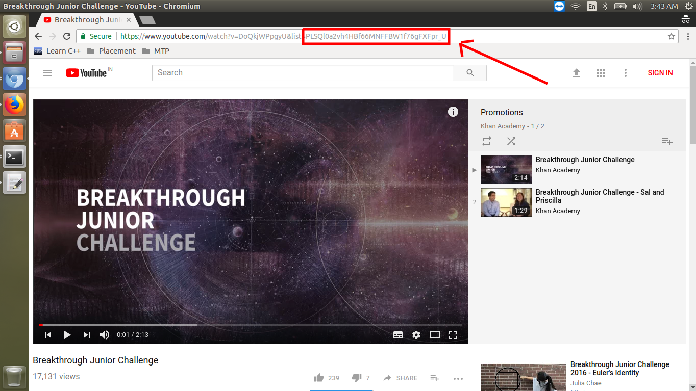
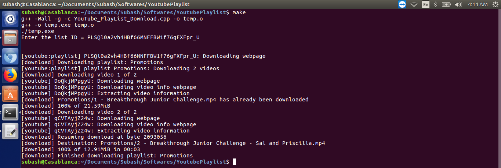

# youtube-playlist-download
This is a short script to download YouTube Playlist using youtube-dl Python script.

# Blog Link
https://medium.com/@subash.cse66/robust-way-to-download-youtube-playlist-10-mins-command-f91b1f3d8d62

# youtube-dl Installation
Please refer the [tutorial](https://github.com/rg3/youtube-dl/blob/master/README.md#installation) given by the developers.

# Usage
1) Please download the YouTube_PlayList_Download.cpp and makefile into same folder.

Navigate to the downloaded folder and type `make` in the terminal.
or 
execute the c++ file.
```
g++ YouTube_PlayList_Download.cpp
./a.out
```

2) The program asks playlist ID as input. Please retrieve it from the youtube and provide it. Refer the following image.

If https://www.youtube.com/watch?v=DoQkjWPpgyU&list=PLSQl0a2vh4HBf66MNFFBW1f76gFXFpr_U is the playlist link.
List ID = PLSQl0a2vh4HBf66MNFFBW1f76gFXFpr_U



# Output



